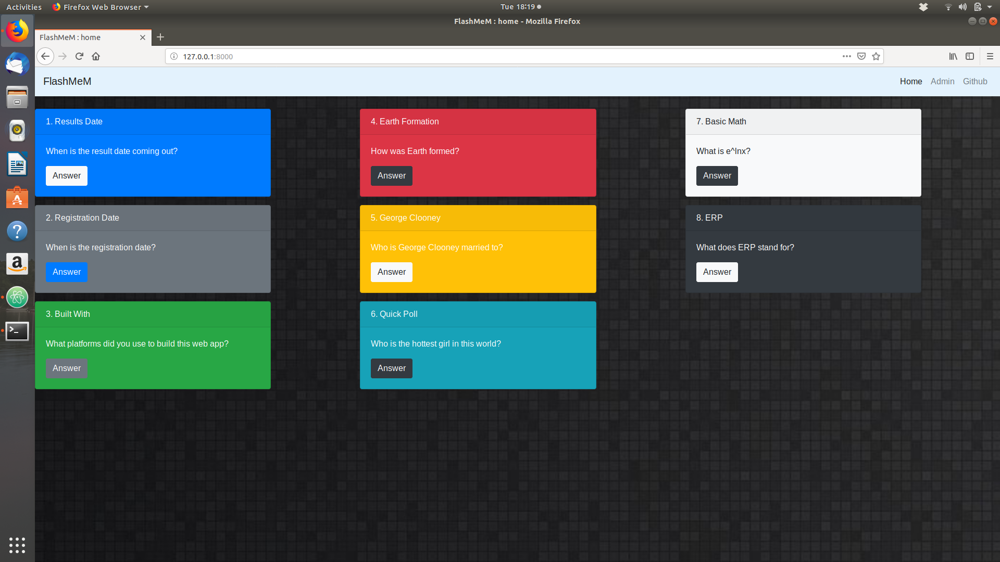
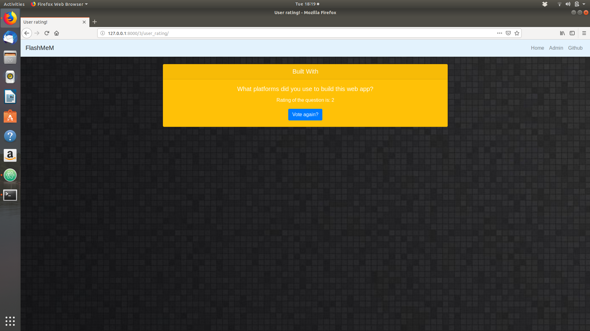
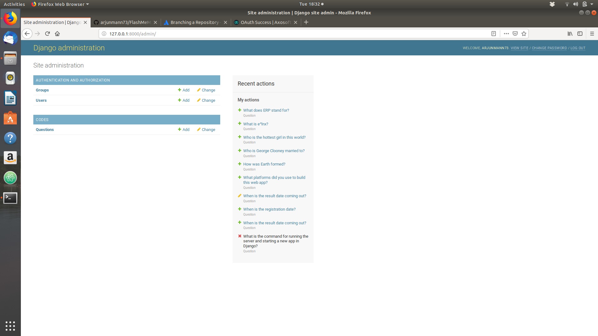

## FlashMeM
#### Flashcards web application.  
A flashcard web app which has the feature of up-down voting a flashcard based on the difficulty to the user. User friendly GUI to create questions, edit or delete them. 8 different colors of flashcards availaible. 

---

## Built with
1. [Django](https://www.djangoproject.com/)
2. [Jinja2](http://jinja.pocoo.org/)
3. [Bootstrap](https://getbootstrap.com/)
4. [SQLite](https://www.sqlite.org/index.html)
5. Python/HTML5/CSS3

---
## User interface - details of a flashcard
Each flashcard has a header, question, answer a buttons to upvote or downvote the flashcard.

---

## User interface - rating of a flashcard
User rating is the quantitative measure of how hard or easy the user finds flashcard.

---

## Admin site
User can add, edit or delete questions using the admin site. 

---

## Authors
@[arjunmann73]()
